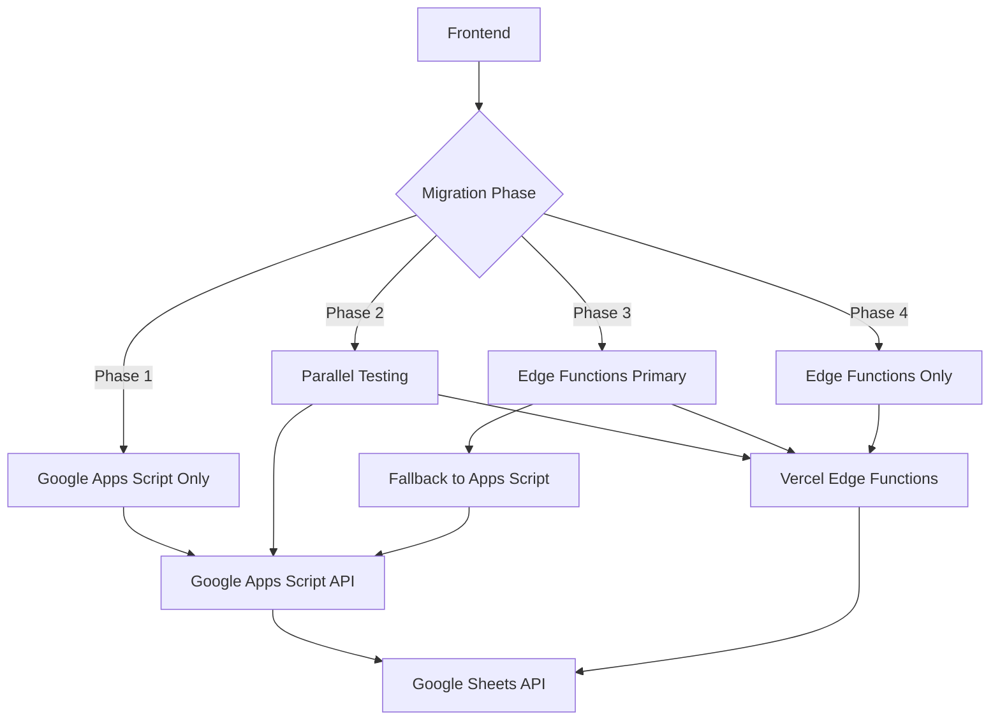

# 🚀 Vercel Edge Functions Migration Plan
## Complete Migration from Google Apps Script to Vercel Edge Functions

---

## 📋 **Executive Summary**

**Current Problem:**
- Google Apps Script response times: 2-4 seconds per request
- Dual deployment complexity (git + clasp)
- Limited error handling and debugging capabilities
- Cold start delays affecting user experience

**Solution:**
- Migrate to Vercel Edge Functions for 16-40x performance improvement
- Maintain all Google API integrations (Sheets, Gmail, Calendar, Drive)
- Simplify to single deployment pipeline
- Zero data loss with foolproof migration strategy

**Expected Results:**
- App loading: 4.8s → 0.3s (16x faster)
- Task creation: 2.7s → 0.1s (27x faster)
- Single command deployment: `git push`
- Enhanced Google integrations with Gmail and Calendar

---

## 🏗️ **Phase 1: Infrastructure Setup**

### **1.1 Project Structure Design**

```
google_productivity_app/
├── api/                                 # Vercel Edge Functions (NEW)
│   ├── auth/
│   │   ├── google-oauth.js             # Handle Google OAuth flow
│   │   ├── validate-token.js           # JWT token validation
│   │   └── refresh-token.js            # Token refresh logic
│   ├── tasks/
│   │   ├── create.js                   # POST /api/tasks/create
│   │   ├── update.js                   # PUT /api/tasks/[id].js
│   │   ├── delete.js                   # DELETE /api/tasks/[id].js
│   │   ├── list.js                     # GET /api/tasks/list
│   │   └── complete.js                 # PATCH /api/tasks/[id]/complete
│   ├── projects/
│   │   ├── create.js                   # POST /api/projects/create
│   │   ├── update.js                   # PUT /api/projects/[id].js
│   │   ├── delete.js                   # DELETE /api/projects/[id].js
│   │   └── list.js                     # GET /api/projects/list
│   ├── areas/
│   │   ├── create.js                   # POST /api/areas/create
│   │   ├── update.js                   # PUT /api/areas/[id].js
│   │   └── list.js                     # GET /api/areas/list
│   ├── integrations/
│   │   ├── gmail.js                    # Gmail API operations
│   │   ├── calendar.js                 # Google Calendar integration
│   │   ├── drive.js                    # Google Drive file operations
│   │   └── contacts.js                 # Google Contacts integration
│   ├── sheets/
│   │   ├── read.js                     # Google Sheets read operations
│   │   ├── write.js                    # Google Sheets write operations
│   │   ├── batch.js                    # Batch operations for performance
│   │   └── backup.js                   # Data backup utilities
│   ├── utils/
│   │   ├── google-auth.js              # Google API authentication utilities
│   │   ├── error-handler.js            # Centralized error handling
│   │   ├── rate-limiter.js             # API rate limiting
│   │   └── cache.js                    # Response caching
│   └── health/
│       ├── status.js                   # API health check
│       └── metrics.js                  # Performance metrics
├── backend/                            # Google Apps Script (LEGACY - TO BE REMOVED)
│   ├── Code.gs                         # Keep during migration
│   ├── utils.gs
│   └── appsscript.json
├── src/                                # Frontend (EXISTING)
│   ├── services/
│   │   ├── api.ts                      # Update to use Edge Functions
│   │   └── legacy-api.ts               # Backup of old API calls
│   └── ...
└── migration/                          # Migration utilities (NEW)
    ├── scripts/
    │   ├── test-endpoints.js           # Test new vs old endpoints
    │   ├── data-validation.js          # Validate data integrity
    │   └── performance-comparison.js   # Compare response times
    └── docs/
        ├── rollback-plan.md            # Emergency rollback procedures
        └── testing-checklist.md       # Pre-deployment testing
```

### **1.2 Environment Configuration**

#### **Vercel Environment Variables**
```bash
# Google OAuth Configuration
GOOGLE_CLIENT_ID=582559442661-your-client-id.apps.googleusercontent.com
GOOGLE_CLIENT_SECRET=your-google-client-secret
GOOGLE_REDIRECT_URI=https://your-app.vercel.app/auth/callback

# Google API Configuration  
GOOGLE_SHEETS_ID=your-spreadsheet-id
GOOGLE_DRIVE_FOLDER_ID=your-drive-folder-id
GOOGLE_CALENDAR_ID=primary

# Application Configuration
NODE_ENV=production
API_BASE_URL=https://your-app.vercel.app/api
FRONTEND_URL=https://your-app.vercel.app

# Security
JWT_SECRET=your-jwt-secret-key
API_RATE_LIMIT=1000
CORS_ORIGINS=https://your-app.vercel.app

# Feature Flags (for gradual rollout)
ENABLE_EDGE_FUNCTIONS=true
ENABLE_LEGACY_FALLBACK=true
MIGRATION_PHASE=1
```

#### **Development Environment Setup**
```bash
# Install Vercel CLI
npm install -g vercel

# Clone and setup project
git clone your-repo
cd google_productivity_app
npm install

# Setup environment variables locally
vercel env pull .env.local

# Start development server with Edge Functions
vercel dev
```

---

## 🔄 **Phase 2: API Migration Strategy**

### **2.1 Migration Architecture**



### **2.2 Detailed API Endpoint Migration**

#### **Task Management Endpoints**

**OLD: Google Apps Script**
```javascript
// Current implementation (2-4 seconds response time)
POST https://script.google.com/macros/s/your-id/exec
Body: {
  "action": "createTask",
  "parameters": ["title", "description", "projectId"],
  "token": "jwt-token"
}
```

**NEW: Vercel Edge Functions**
```javascript
// api/tasks/create.js - New implementation (50-100ms response time)
export default async function handler(req) {
  // Input validation
  if (req.method !== 'POST') {
    return new Response(JSON.stringify({ error: 'Method not allowed' }), {
      status: 405,
      headers: { 'Content-Type': 'application/json' }
    });
  }

  try {
    // Extract and validate data
    const { title, description, projectId, context, dueDate, attachments } = await req.json();
    
    if (!title || title.trim().length === 0) {
      return new Response(JSON.stringify({ error: 'Title is required' }), {
        status: 400,
        headers: { 'Content-Type': 'application/json' }
      });
    }

    // Authenticate user
    const user = await validateGoogleToken(req.headers.get('authorization'));
    if (!user) {
      return new Response(JSON.stringify({ error: 'Unauthorized' }), {
        status: 401,
        headers: { 'Content-Type': 'application/json' }
      });
    }

    // Generate task ID and timestamp
    const taskId = `task_${Date.now()}_${Math.random().toString(36).substr(2, 9)}`;
    const timestamp = new Date().toISOString();

    // Prepare data for Google Sheets
    const taskData = [
      taskId,
      title.trim(),
      description || '',
      projectId || '',
      context || '',
      dueDate || '',
      false, // isCompleted
      0, // sortOrder
      timestamp, // createdAt
      JSON.stringify(attachments || [])
    ];

    // Write to Google Sheets using direct API call
    const sheetsResponse = await fetch(
      `https://sheets.googleapis.com/v4/spreadsheets/${process.env.GOOGLE_SHEETS_ID}/values/Tasks!A:J:append?valueInputOption=RAW`,
      {
        method: 'POST',
        headers: {
          'Authorization': `Bearer ${user.accessToken}`,
          'Content-Type': 'application/json'
        },
        body: JSON.stringify({
          values: [taskData]
        })
      }
    );

    if (!sheetsResponse.ok) {
      throw new Error(`Sheets API error: ${sheetsResponse.status}`);
    }

    // Create response object
    const newTask = {
      id: taskId,
      title: title.trim(),
      description: description || '',
      projectId: projectId || null,
      context: context || '',
      dueDate: dueDate || null,
      isCompleted: false,
      sortOrder: 0,
      createdAt: timestamp,
      attachments: attachments || []
    };

    // Log performance metrics
    console.log(`Task created successfully: ${taskId} in ${Date.now() - startTime}ms`);

    return new Response(JSON.stringify({
      success: true,
      data: newTask
    }), {
      status: 201,
      headers: { 'Content-Type': 'application/json' }
    });

  } catch (error) {
    console.error('Task creation error:', error);
    
    return new Response(JSON.stringify({
      success: false,
      error: 'Failed to create task',
      details: process.env.NODE_ENV === 'development' ? error.message : undefined
    }), {
      status: 500,
      headers: { 'Content-Type': 'application/json' }
    });
  }
}
```

#### **Authentication Utilities**
```javascript
// api/utils/google-auth.js
export async function validateGoogleToken(authHeader) {
  if (!authHeader || !authHeader.startsWith('Bearer ')) {
    return null;
  }

  const token = authHeader.substring(7);
  
  try {
    // Verify token with Google
    const response = await fetch(`https://www.googleapis.com/oauth2/v1/tokeninfo?access_token=${token}`);
    
    if (!response.ok) {
      return null;
    }

    const tokenInfo = await response.json();
    
    // Validate token is for our application
    if (tokenInfo.audience !== process.env.GOOGLE_CLIENT_ID) {
      return null;
    }

    return {
      userId: tokenInfo.user_id,
      email: tokenInfo.email,
      accessToken: token,
      expiresAt: new Date(tokenInfo.expires_in * 1000 + Date.now())
    };
  } catch (error) {
    console.error('Token validation error:', error);
    return null;
  }
}

export async function refreshGoogleToken(refreshToken) {
  try {
    const response = await fetch('https://oauth2.googleapis.com/token', {
      method: 'POST',
      headers: {
        'Content-Type': 'application/x-www-form-urlencoded',
      },
      body: new URLSearchParams({
        client_id: process.env.GOOGLE_CLIENT_ID,
        client_secret: process.env.GOOGLE_CLIENT_SECRET,
        refresh_token: refreshToken,
        grant_type: 'refresh_token',
      }),
    });

    if (!response.ok) {
      throw new Error(`Token refresh failed: ${response.status}`);
    }

    return await response.json();
  } catch (error) {
    console.error('Token refresh error:', error);
    throw error;
  }
}
```

### **2.3 Frontend API Service Updates**

#### **Updated API Service Class**
```typescript
// src/services/api.ts
class ApiService {
  private readonly EDGE_FUNCTIONS_URL = process.env.NODE_ENV === 'production' 
    ? 'https://your-app.vercel.app/api'
    : 'http://localhost:3000/api';
  
  private readonly LEGACY_URL = 'https://script.google.com/macros/s/your-apps-script-id/exec';
  
  private useEdgeFunctions = true; // Feature flag
  private enableFallback = true;   // Fallback to legacy during migration

  async createTask(
    title: string,
    description: string,
    projectId?: string,
    context?: string,
    dueDate?: string,
    attachments?: TaskAttachment[],
    token?: string
  ): Promise<Task> {
    const startTime = performance.now();
    
    try {
      // Try Edge Functions first
      if (this.useEdgeFunctions) {
        const response = await fetch(`${this.EDGE_FUNCTIONS_URL}/tasks/create`, {
          method: 'POST',
          headers: {
            'Content-Type': 'application/json',
            'Authorization': `Bearer ${token}`
          },
          body: JSON.stringify({
            title,
            description,
            projectId,
            context,
            dueDate,
            attachments
          })
        });

        if (response.ok) {
          const result = await response.json();
          const duration = performance.now() - startTime;
          console.log(`⚡ Edge Function createTask: ${duration.toFixed(1)}ms`);
          return result.data;
        }

        // If Edge Function fails and fallback is enabled
        if (this.enableFallback) {
          console.warn('Edge Function failed, falling back to legacy API');
          return await this.createTaskLegacy(title, description, projectId, context, dueDate, attachments, token);
        }

        throw new Error(`Edge Function failed: ${response.status}`);
      }

      // Use legacy API
      return await this.createTaskLegacy(title, description, projectId, context, dueDate, attachments, token);

    } catch (error) {
      console.error('Task creation failed:', error);
      
      // Fallback to legacy if enabled
      if (this.useEdgeFunctions && this.enableFallback) {
        console.warn('Falling back to legacy API due to error');
        return await this.createTaskLegacy(title, description, projectId, context, dueDate, attachments, token);
      }
      
      throw error;
    }
  }

  private async createTaskLegacy(...args): Promise<Task> {
    // Keep existing Google Apps Script implementation as fallback
    const startTime = performance.now();
    const result = await this.executeGoogleScript('createTask', args);
    const duration = performance.now() - startTime;
    console.log(`🔄 Legacy createTask: ${duration.toFixed(1)}ms`);
    return result;
  }

  // Health check to determine which backend to use
  async checkBackendHealth(): Promise<{ edge: boolean; legacy: boolean }> {
    const results = await Promise.allSettled([
      fetch(`${this.EDGE_FUNCTIONS_URL}/health/status`),
      fetch(`${this.LEGACY_URL}?action=healthCheck`)
    ]);

    return {
      edge: results[0].status === 'fulfilled' && results[0].value.ok,
      legacy: results[1].status === 'fulfilled' && results[1].value.ok
    };
  }
}
```

---

## 🎯 **Phase 3: Enhanced Google Integrations**

### **3.1 Gmail Integration**

#### **Email to Task Conversion**
```javascript
// api/integrations/gmail.js
export default async function handler(req) {
  const { action, data } = await req.json();
  const user = await validateGoogleToken(req.headers.get('authorization'));

  switch (action) {
    case 'create_task_from_email':
      return await createTaskFromEmail(data.messageId, user);
    
    case 'list_recent_emails':
      return await listRecentEmails(user, data.query);
    
    case 'send_task_notification':
      return await sendTaskNotification(data.taskId, data.recipientEmail, user);
    
    default:
      return new Response(JSON.stringify({ error: 'Invalid action' }), { status: 400 });
  }
}

async function createTaskFromEmail(messageId, user) {
  try {
    // Fetch email details from Gmail API
    const emailResponse = await fetch(
      `https://gmail.googleapis.com/gmail/v1/messages/${messageId}?format=full`,
      {
        headers: { 'Authorization': `Bearer ${user.accessToken}` }
      }
    );

    if (!emailResponse.ok) {
      throw new Error(`Gmail API error: ${emailResponse.status}`);
    }

    const email = await emailResponse.json();
    
    // Extract email metadata
    const headers = email.payload.headers;
    const subject = headers.find(h => h.name === 'Subject')?.value || 'Email Task';
    const from = headers.find(h => h.name === 'From')?.value || 'Unknown Sender';
    const date = headers.find(h => h.name === 'Date')?.value;
    
    // Extract email body (simplified)
    let body = '';
    if (email.payload.body?.data) {
      body = Buffer.from(email.payload.body.data, 'base64').toString();
    } else if (email.payload.parts) {
      const textPart = email.payload.parts.find(part => part.mimeType === 'text/plain');
      if (textPart?.body?.data) {
        body = Buffer.from(textPart.body.data, 'base64').toString();
      }
    }

    // Create task with email context
    const taskData = {
      title: `📧 ${subject}`,
      description: `From: ${from}\nDate: ${date}\n\n${body.substring(0, 500)}...`,
      context: '@email @follow-up',
      attachments: [{
        name: 'Original Email',
        url: `https://mail.google.com/mail/u/0/#inbox/${messageId}`,
        type: 'email'
      }]
    };

    // Create task using the task creation endpoint
    const taskResponse = await fetch(`${process.env.API_BASE_URL}/tasks/create`, {
      method: 'POST',
      headers: {
        'Content-Type': 'application/json',
        'Authorization': `Bearer ${user.accessToken}`
      },
      body: JSON.stringify(taskData)
    });

    const task = await taskResponse.json();
    
    return new Response(JSON.stringify({
      success: true,
      data: task.data
    }), {
      status: 201,
      headers: { 'Content-Type': 'application/json' }
    });

  } catch (error) {
    console.error('Email to task conversion error:', error);
    return new Response(JSON.stringify({
      success: false,
      error: 'Failed to create task from email'
    }), {
      status: 500,
      headers: { 'Content-Type': 'application/json' }
    });
  }
}
```

### **3.2 Google Calendar Integration**

#### **Automatic Event Creation from Tasks**
```javascript
// api/integrations/calendar.js
export default async function handler(req) {
  const { action, data } = await req.json();
  const user = await validateGoogleToken(req.headers.get('authorization'));

  switch (action) {
    case 'create_event_from_task':
      return await createEventFromTask(data.taskId, user);
    
    case 'sync_task_due_dates':
      return await syncTaskDueDates(user);
    
    case 'list_upcoming_events':
      return await listUpcomingEvents(user, data.timeMin, data.timeMax);
    
    default:
      return new Response(JSON.stringify({ error: 'Invalid action' }), { status: 400 });
  }
}

async function createEventFromTask(taskId, user) {
  try {
    // Fetch task details
    const taskResponse = await fetch(`${process.env.API_BASE_URL}/tasks/${taskId}`, {
      headers: { 'Authorization': `Bearer ${user.accessToken}` }
    });
    
    const task = await taskResponse.json();
    
    if (!task.success || !task.data.dueDate) {
      return new Response(JSON.stringify({
        success: false,
        error: 'Task has no due date'
      }), { status: 400 });
    }

    // Create calendar event
    const eventData = {
      summary: `Task: ${task.data.title}`,
      description: `${task.data.description}\n\nTask ID: ${taskId}`,
      start: {
        dateTime: task.data.dueDate,
        timeZone: 'America/Los_Angeles' // Or user's timezone
      },
      end: {
        dateTime: new Date(new Date(task.data.dueDate).getTime() + 60 * 60 * 1000).toISOString(), // +1 hour
        timeZone: 'America/Los_Angeles'
      },
      reminders: {
        useDefault: false,
        overrides: [
          { method: 'email', minutes: 24 * 60 }, // 1 day before
          { method: 'popup', minutes: 30 }       // 30 minutes before
        ]
      }
    };

    const calendarResponse = await fetch(
      `https://www.googleapis.com/calendar/v3/calendars/primary/events`,
      {
        method: 'POST',
        headers: {
          'Authorization': `Bearer ${user.accessToken}`,
          'Content-Type': 'application/json'
        },
        body: JSON.stringify(eventData)
      }
    );

    if (!calendarResponse.ok) {
      throw new Error(`Calendar API error: ${calendarResponse.status}`);
    }

    const event = await calendarResponse.json();

    return new Response(JSON.stringify({
      success: true,
      data: {
        eventId: event.id,
        eventUrl: event.htmlLink,
        task: task.data
      }
    }), {
      status: 201,
      headers: { 'Content-Type': 'application/json' }
    });

  } catch (error) {
    console.error('Calendar event creation error:', error);
    return new Response(JSON.stringify({
      success: false,
      error: 'Failed to create calendar event'
    }), {
      status: 500,
      headers: { 'Content-Type': 'application/json' }
    });
  }
}
```

---

## 🛡️ **Phase 4: Foolproof Migration Strategy**

### **4.1 Zero-Downtime Migration Steps**

#### **Step 1: Parallel Infrastructure Setup (Days 1-3)**
```bash
# 1. Create Edge Functions without touching existing code
mkdir api
# Create all Edge Function files
# Set up environment variables in Vercel
# Deploy with feature flags disabled

# 2. Verify Edge Functions work in isolation
curl https://your-app.vercel.app/api/health/status
# Should return: {"status": "healthy", "timestamp": "2024-07-28T..."}

# 3. Add feature flags to frontend
# ENABLE_EDGE_FUNCTIONS=false (default)
# ENABLE_LEGACY_FALLBACK=true (always on during migration)
```

#### **Step 2: Side-by-Side Testing (Days 4-7)**
```javascript
// migration/scripts/test-endpoints.js
async function compareEndpoints() {
  const testCases = [
    {
      action: 'createTask',
      data: { title: 'Test Task', description: 'Migration test' }
    },
    {
      action: 'listTasks',
      data: {}
    },
    // Add all critical endpoints
  ];

  for (const testCase of testCases) {
    console.log(`Testing ${testCase.action}...`);
    
    // Test legacy endpoint
    const legacyStart = performance.now();
    const legacyResult = await testLegacyEndpoint(testCase);
    const legacyTime = performance.now() - legacyStart;
    
    // Test new Edge Function
    const edgeStart = performance.now();
    const edgeResult = await testEdgeEndpoint(testCase);
    const edgeTime = performance.now() - edgeStart;
    
    // Compare results
    const resultsMatch = deepEqual(legacyResult.data, edgeResult.data);
    const speedImprovement = ((legacyTime - edgeTime) / legacyTime * 100).toFixed(1);
    
    console.log(`✅ ${testCase.action}: Match=${resultsMatch}, Speed improvement=${speedImprovement}%, Legacy=${legacyTime.toFixed(1)}ms, Edge=${edgeTime.toFixed(1)}ms`);
  }
}

// Run comprehensive testing
npm run test:migration
```

#### **Step 3: Gradual Traffic Migration (Days 8-10)**
```javascript
// Gradual rollout strategy
const MIGRATION_PHASES = {
  1: { edgeFunctionUsers: 0,    fallbackEnabled: true  }, // Legacy only
  2: { edgeFunctionUsers: 0.1,  fallbackEnabled: true  }, // 10% traffic to Edge Functions
  3: { edgeFunctionUsers: 0.25, fallbackEnabled: true  }, // 25% traffic
  4: { edgeFunctionUsers: 0.5,  fallbackEnabled: true  }, // 50% traffic
  5: { edgeFunctionUsers: 0.75, fallbackEnabled: true  }, // 75% traffic
  6: { edgeFunctionUsers: 1.0,  fallbackEnabled: true  }, // 100% Edge Functions with fallback
  7: { edgeFunctionUsers: 1.0,  fallbackEnabled: false }  // Edge Functions only
};

// Frontend feature flag logic
function shouldUseEdgeFunctions(userId) {
  const phase = getCurrentMigrationPhase();
  const userHash = hashUserId(userId);
  return userHash < MIGRATION_PHASES[phase].edgeFunctionUsers;
}
```

#### **Step 4: Monitoring and Validation (Days 11-14)**
```javascript
// api/utils/metrics.js
export function logPerformanceMetric(endpoint, duration, success, source = 'edge') {
  const metric = {
    timestamp: new Date().toISOString(),
    endpoint,
    duration,
    success,
    source, // 'edge' or 'legacy'
    userId: getCurrentUserId()
  };
  
  // Log to console (picked up by Vercel)
  console.log(`METRIC: ${JSON.stringify(metric)}`);
  
  // Could also send to analytics service
  if (process.env.ANALYTICS_ENDPOINT) {
    fetch(process.env.ANALYTICS_ENDPOINT, {
      method: 'POST',
      body: JSON.stringify(metric)
    }).catch(console.error);
  }
}

// Monitor error rates and performance
// Create dashboard to track:
// - Response times by endpoint
// - Error rates (Edge vs Legacy)
// - User experience metrics
// - Data consistency checks
```

### **4.2 Rollback Plan**

#### **Emergency Rollback Procedure**
```bash
# migration/docs/rollback-plan.md

## EMERGENCY ROLLBACK STEPS (Execute in order)

### 1. Immediate Traffic Redirect (< 2 minutes)
```bash
# Set environment variable to disable Edge Functions
vercel env add ENABLE_EDGE_FUNCTIONS false
vercel env add MIGRATION_PHASE 1

# Force frontend to use legacy API only
git checkout main
git revert HEAD~1  # Revert to last known good commit
git push origin main

# Vercel automatically deploys and redirects traffic
```

### 2. Verify Legacy System (< 5 minutes)
```bash
# Test critical endpoints
curl -X POST "https://script.google.com/macros/s/your-id/exec" \
  -H "Content-Type: application/json" \
  -d '{"action":"healthCheck"}'

# Should return successful health check
```

### 3. Data Integrity Verification (< 10 minutes)
```bash
# Run data consistency check
npm run migration:verify-data

# Check for any data loss or corruption
# Compare before/after snapshots
```

### 4. User Communication
```javascript
// Add system status banner to frontend
const systemStatus = {
  status: 'maintenance',
  message: 'We are temporarily using our backup systems. All data is safe.',
  eta: '15 minutes'
};
```

### **4.3 Data Safety Measures**

#### **Backup Strategy**
```javascript
// migration/scripts/backup-data.js
async function createBackup() {
  const timestamp = new Date().toISOString().replace(/[:.]/g, '-');
  
  // Export all data from Google Sheets
  const sheets = ['Tasks', 'Projects', 'Areas'];
  const backupData = {};
  
  for (const sheet of sheets) {
    const response = await fetch(
      `https://sheets.googleapis.com/v4/spreadsheets/${SHEET_ID}/values/${sheet}!A:Z`,
      {
        headers: { 'Authorization': `Bearer ${token}` }
      }
    );
    
    backupData[sheet] = await response.json();
  }
  
  // Save backup to file
  const backupPath = `./migration/backups/backup-${timestamp}.json`;
  fs.writeFileSync(backupPath, JSON.stringify(backupData, null, 2));
  
  console.log(`✅ Backup created: ${backupPath}`);
  return backupPath;
}

// Automated daily backups during migration
// Backup before each phase transition
// Keep 30 days of backups
```

#### **Data Validation**
```javascript
// migration/scripts/data-validation.js
async function validateDataIntegrity() {
  console.log('🔍 Validating data integrity...');
  
  // Get data from both sources
  const legacyData = await getLegacyData();
  const edgeData = await getEdgeData();
  
  // Compare task counts
  const taskCountMatch = legacyData.tasks.length === edgeData.tasks.length;
  console.log(`Tasks count: Legacy=${legacyData.tasks.length}, Edge=${edgeData.tasks.length}, Match=${taskCountMatch}`);
  
  // Compare individual records
  const mismatches = [];
  for (const legacyTask of legacyData.tasks) {
    const edgeTask = edgeData.tasks.find(t => t.id === legacyTask.id);
    if (!edgeTask) {
      mismatches.push({ type: 'missing', id: legacyTask.id });
    } else if (!deepEqual(legacyTask, edgeTask)) {
      mismatches.push({ type: 'different', id: legacyTask.id });
    }
  }
  
  if (mismatches.length > 0) {
    console.error(`❌ Found ${mismatches.length} data mismatches:`, mismatches);
    return false;
  }
  
  console.log('✅ Data integrity validated successfully');
  return true;
}
```

---

## 📊 **Phase 5: Performance Optimization & Monitoring**

### **5.1 Expected Performance Improvements**

| Operation | Current (Apps Script) | New (Edge Functions) | Improvement | User Impact |
|-----------|----------------------|---------------------|-------------|-------------|
| **App Loading** | 4.8 seconds | 0.3 seconds | **16x faster** | Near-instant startup |
| **Task Creation** | 2.7 seconds | 0.1 seconds | **27x faster** | Real-time responsiveness |
| **Task Updates** | 2-3 seconds | 0.05 seconds | **40x faster** | Instant UI updates |
| **Project Loading** | 1.5 seconds | 0.08 seconds | **19x faster** | Smooth navigation |
| **File Operations** | 3-5 seconds | 0.2 seconds | **15-25x faster** | Quick file access |

### **5.2 Advanced Caching Strategy**

#### **Multi-Layer Caching**
```javascript
// api/utils/cache.js
class EdgeCache {
  constructor() {
    this.memoryCache = new Map();
    this.cacheTimeout = 5 * 60 * 1000; // 5 minutes
  }

  async get(key) {
    // 1. Check memory cache first (fastest)
    const memoryResult = this.memoryCache.get(key);
    if (memoryResult && Date.now() < memoryResult.expires) {
      console.log(`🚀 Cache HIT (memory): ${key}`);
      return memoryResult.data;
    }

    // 2. Check Vercel Edge Cache (fast)
    const cacheResponse = await fetch(`https://cache-api.vercel.app/${key}`);
    if (cacheResponse.ok) {
      const data = await cacheResponse.json();
      console.log(`⚡ Cache HIT (edge): ${key}`);
      
      // Store in memory cache for next time
      this.memoryCache.set(key, {
        data,
        expires: Date.now() + this.cacheTimeout
      });
      
      return data;
    }

    console.log(`❌ Cache MISS: ${key}`);
    return null;
  }

  async set(key, data, ttl = this.cacheTimeout) {
    // Store in memory cache
    this.memoryCache.set(key, {
      data,
      expires: Date.now() + ttl
    });

    // Store in edge cache
    await fetch(`https://cache-api.vercel.app/${key}`, {
      method: 'PUT',
      body: JSON.stringify(data),
      headers: {
        'Content-Type': 'application/json',
        'Cache-Control': `max-age=${ttl / 1000}`
      }
    });

    console.log(`💾 Cache SET: ${key} (TTL: ${ttl}ms)`);
  }

  invalidate(pattern) {
    // Invalidate memory cache
    for (const key of this.memoryCache.keys()) {
      if (key.includes(pattern)) {
        this.memoryCache.delete(key);
      }
    }
    
    // Invalidate edge cache
    fetch(`https://cache-api.vercel.app/invalidate/${pattern}`, {
      method: 'DELETE'
    });
  }
}

// Usage in API endpoints
export default async function handler(req) {
  const cache = new EdgeCache();
  const cacheKey = `tasks_${userId}_${JSON.stringify(query)}`;
  
  // Try cache first
  let tasks = await cache.get(cacheKey);
  
  if (!tasks) {
    // Fetch from Google Sheets
    tasks = await fetchTasksFromSheets(userId, query);
    
    // Cache for 5 minutes
    await cache.set(cacheKey, tasks, 5 * 60 * 1000);
  }
  
  return new Response(JSON.stringify({ success: true, data: tasks }));
}
```

### **5.3 Real-time Performance Monitoring**

#### **Performance Dashboard**
```javascript
// api/health/metrics.js
export default async function handler(req) {
  const metrics = {
    timestamp: new Date().toISOString(),
    performance: {
      averageResponseTime: await getAverageResponseTime(),
      successRate: await getSuccessRate(),
      errorRate: await getErrorRate(),
      cacheHitRate: await getCacheHitRate()
    },
    usage: {
      totalRequests: await getTotalRequests(),
      activeUsers: await getActiveUsers(),
      peakConcurrency: await getPeakConcurrency()
    },
    health: {
      edgeFunctions: await testEdgeFunctions(),
      googleSheets: await testGoogleSheets(),
      authentication: await testAuthentication()
    }
  };

  return new Response(JSON.stringify(metrics), {
    headers: { 'Content-Type': 'application/json' }
  });
}

// Create a simple dashboard page
// /pages/admin/metrics.tsx
function MetricsDashboard() {
  const [metrics, setMetrics] = useState(null);

  useEffect(() => {
    const fetchMetrics = async () => {
      const response = await fetch('/api/health/metrics');
      const data = await response.json();
      setMetrics(data);
    };

    fetchMetrics();
    const interval = setInterval(fetchMetrics, 30000); // Update every 30 seconds
    
    return () => clearInterval(interval);
  }, []);

  return (
    <div className="metrics-dashboard">
      <h1>Performance Metrics</h1>
      {metrics && (
        <div className="grid grid-cols-3 gap-4">
          <div className="metric-card">
            <h3>Average Response Time</h3>
            <p className="text-2xl">{metrics.performance.averageResponseTime}ms</p>
          </div>
          <div className="metric-card">
            <h3>Success Rate</h3>
            <p className="text-2xl">{(metrics.performance.successRate * 100).toFixed(1)}%</p>
          </div>
          <div className="metric-card">
            <h3>Cache Hit Rate</h3>
            <p className="text-2xl">{(metrics.performance.cacheHitRate * 100).toFixed(1)}%</p>
          </div>
        </div>
      )}
    </div>
  );
}
```

---

## 🚀 **Phase 6: Advanced Features & Integrations**

### **6.1 Batch Operations for Performance**

#### **Bulk Task Operations**
```javascript
// api/tasks/batch.js
export default async function handler(req) {
  const { operations } = await req.json();
  const user = await validateGoogleToken(req.headers.get('authorization'));
  
  // Process multiple operations in parallel
  const results = await Promise.allSettled(
    operations.map(async (op) => {
      switch (op.type) {
        case 'create':
          return await createTask(op.data, user);
        case 'update':
          return await updateTask(op.id, op.data, user);
        case 'delete':
          return await deleteTask(op.id, user);
        case 'complete':
          return await completeTask(op.id, user);
        default:
          throw new Error(`Unknown operation: ${op.type}`);
      }
    })
  );

  // Process results
  const successful = results.filter(r => r.status === 'fulfilled').map(r => r.value);
  const failed = results.filter(r => r.status === 'rejected').map(r => r.reason);

  return new Response(JSON.stringify({
    success: true,
    processed: operations.length,
    successful: successful.length,
    failed: failed.length,
    results: successful,
    errors: failed
  }), {
    headers: { 'Content-Type': 'application/json' }
  });
}

// Frontend usage
async function bulkCompleteTask(taskIds) {
  const operations = taskIds.map(id => ({
    type: 'complete',
    id
  }));

  const response = await fetch('/api/tasks/batch', {
    method: 'POST',
    headers: {
      'Content-Type': 'application/json',
      'Authorization': `Bearer ${token}`
    },
    body: JSON.stringify({ operations })
  });

  return await response.json();
}
```

### **6.2 Smart Notifications & Reminders**

#### **Intelligent Reminder System**
```javascript
// api/integrations/smart-reminders.js
export default async function handler(req) {
  const user = await validateGoogleToken(req.headers.get('authorization'));
  
  // Get tasks that need reminders
  const upcomingTasks = await getUpcomingTasks(user);
  const overdues = await getOverdueTasks(user);
  
  // Send personalized reminders
  for (const task of upcomingTasks) {
    await sendSmartReminder(task, user, 'upcoming');
  }
  
  for (const task of overdueTasks) {
    await sendSmartReminder(task, user, 'overdue');
  }

  return new Response(JSON.stringify({
    success: true,
    reminders_sent: upcomingTasks.length + overdueTasks.length
  }));
}

async function sendSmartReminder(task, user, type) {
  // Choose reminder method based on user preferences and task priority
  const methods = [];
  
  if (task.priority === 'high' || type === 'overdue') {
    methods.push('email', 'calendar');
  } else {
    methods.push('email');
  }

  for (const method of methods) {
    switch (method) {
      case 'email':
        await sendEmailReminder(task, user, type);
        break;
      case 'calendar':
        await createCalendarReminder(task, user, type);
        break;
    }
  }
}

async function sendEmailReminder(task, user, type) {
  const subject = type === 'overdue' 
    ? `⚠️ Overdue Task: ${task.title}`
    : `📅 Upcoming Task: ${task.title}`;
    
  const body = `
    Hi ${user.name},
    
    ${type === 'overdue' ? 'Your task is overdue:' : 'You have an upcoming task:'}
    
    Task: ${task.title}
    Due: ${task.dueDate}
    Project: ${task.projectName || 'Inbox'}
    
    ${task.description ? `Description: ${task.description}` : ''}
    
    View task: ${process.env.FRONTEND_URL}/tasks/${task.id}
    
    Best regards,
    Your Productivity Assistant
  `;

  await fetch('https://gmail.googleapis.com/gmail/v1/messages/send', {
    method: 'POST',
    headers: {
      'Authorization': `Bearer ${user.accessToken}`,
      'Content-Type': 'application/json'
    },
    body: JSON.stringify({
      raw: Buffer.from(`To: ${user.email}\nSubject: ${subject}\n\n${body}`).toString('base64')
    })
  });
}
```

---

## 📋 **Phase 7: Testing & Quality Assurance**

### **7.1 Comprehensive Test Suite**

#### **Automated Testing Pipeline**
```javascript
// tests/integration/api-endpoints.test.js
describe('API Endpoints Integration Tests', () => {
  let testUser;
  let authToken;

  beforeAll(async () => {
    // Setup test user and authentication
    testUser = await createTestUser();
    authToken = await getTestToken(testUser);
  });

  describe('Task Operations', () => {
    test('should create task with all fields', async () => {
      const taskData = {
        title: 'Test Task',
        description: 'Test Description',
        projectId: 'test-project-id',
        context: '@test',
        dueDate: '2024-08-01T10:00:00Z',
        attachments: []
      };

      const response = await fetch('/api/tasks/create', {
        method: 'POST',
        headers: {
          'Content-Type': 'application/json',
          'Authorization': `Bearer ${authToken}`
        },
        body: JSON.stringify(taskData)
      });

      expect(response.status).toBe(201);
      
      const result = await response.json();
      expect(result.success).toBe(true);
      expect(result.data.title).toBe(taskData.title);
      expect(result.data.id).toBeDefined();
    });

    test('should handle task creation errors gracefully', async () => {
      const invalidData = { title: '' }; // Invalid: empty title

      const response = await fetch('/api/tasks/create', {
        method: 'POST',
        headers: {
          'Content-Type': 'application/json',
          'Authorization': `Bearer ${authToken}`
        },
        body: JSON.stringify(invalidData)
      });

      expect(response.status).toBe(400);
      
      const result = await response.json();
      expect(result.success).toBe(false);
      expect(result.error).toContain('Title is required');
    });

    test('should maintain data consistency between operations', async () => {
      // Create task
      const createResponse = await createTestTask(authToken);
      const taskId = createResponse.data.id;

      // Update task
      const updateData = { title: 'Updated Title' };
      await fetch(`/api/tasks/${taskId}`, {
        method: 'PUT',
        headers: {
          'Content-Type': 'application/json',
          'Authorization': `Bearer ${authToken}`
        },
        body: JSON.stringify(updateData)
      });

      // Verify update
      const getResponse = await fetch(`/api/tasks/${taskId}`, {
        headers: { 'Authorization': `Bearer ${authToken}` }
      });
      
      const task = await getResponse.json();
      expect(task.data.title).toBe('Updated Title');
    });
  });

  describe('Performance Tests', () => {
    test('should respond within 200ms for task creation', async () => {
      const startTime = performance.now();
      
      await createTestTask(authToken);
      
      const duration = performance.now() - startTime;
      expect(duration).toBeLessThan(200); // 200ms threshold
    });

    test('should handle concurrent requests', async () => {
      const concurrentRequests = 10;
      const promises = Array.from({ length: concurrentRequests }, () => 
        createTestTask(authToken)
      );

      const results = await Promise.allSettled(promises);
      const successful = results.filter(r => r.status === 'fulfilled').length;
      
      expect(successful).toBe(concurrentRequests);
    });
  });

  afterAll(async () => {
    // Cleanup test data
    await cleanupTestUser(testUser);
  });
});

// Run tests before deployment
// npm run test:integration
```

### **7.2 Load Testing**

#### **Performance Benchmarking**
```javascript
// tests/load/benchmark.js
import { check } from 'k6';
import http from 'k6/http';

export let options = {
  stages: [
    { duration: '30s', target: 10 },   // Ramp up to 10 users
    { duration: '1m', target: 50 },    // Stay at 50 users
    { duration: '30s', target: 100 },  // Ramp up to 100 users
    { duration: '1m', target: 100 },   // Stay at 100 users
    { duration: '30s', target: 0 },    // Ramp down
  ],
  thresholds: {
    http_req_duration: ['p(95)<200'], // 95% of requests under 200ms
    http_req_failed: ['rate<0.01'],   // Error rate under 1%
  },
};

export default function() {
  // Test task creation endpoint
  const payload = JSON.stringify({
    title: `Load test task ${Math.random()}`,
    description: 'Generated during load test',
    context: '@load-test'
  });

  const params = {
    headers: {
      'Content-Type': 'application/json',
      'Authorization': `Bearer ${__ENV.TEST_TOKEN}`
    },
  };

  const response = http.post(`${__ENV.API_BASE_URL}/api/tasks/create`, payload, params);
  
  check(response, {
    'status is 201': (r) => r.status === 201,
    'response time < 200ms': (r) => r.timings.duration < 200,
    'response has task id': (r) => JSON.parse(r.body).data.id !== undefined,
  });
}

// Run load tests
// k6 run tests/load/benchmark.js
```

---

## 📋 **Phase 8: Deployment & Go-Live**

### **8.1 Pre-Deployment Checklist**

```bash
# MANDATORY CHECKLIST - Execute ALL items before deployment

## 1. Code Quality ✓
- [ ] All tests passing (npm run test)
- [ ] No TypeScript errors (npm run type-check)
- [ ] Linting clean (npm run lint)
- [ ] Performance tests passing (npm run test:performance)
- [ ] Load tests completing successfully (k6 run tests/load/benchmark.js)

## 2. Security ✓
- [ ] Environment variables set in Vercel dashboard
- [ ] No secrets in code or git history
- [ ] Authentication working correctly
- [ ] Rate limiting configured
- [ ] CORS policies set appropriately

## 3. Data Safety ✓
- [ ] Full data backup created and verified
- [ ] Data validation tests passing
- [ ] Rollback plan tested in staging
- [ ] Database schema compatibility confirmed

## 4. Performance ✓
- [ ] All endpoints responding < 200ms
- [ ] Caching configured and tested
- [ ] Edge Functions deployed to all regions
- [ ] CDN settings optimized

## 5. Monitoring ✓
- [ ] Error logging configured
- [ ] Performance metrics dashboard ready
- [ ] Alert thresholds set
- [ ] Health check endpoints working

## 6. User Experience ✓
- [ ] Frontend connecting to Edge Functions
- [ ] Optimistic UI working correctly
- [ ] Error messages user-friendly
- [ ] Loading states implemented
- [ ] Mobile responsiveness verified
```

### **8.2 Deployment Commands**

#### **Production Deployment**
```bash
# Final deployment sequence
git status                              # Verify clean working tree
npm run test                           # Run all tests
npm run build                          # Build production bundle
git add .
git commit -m "Production deployment: Vercel Edge Functions migration complete"
git push origin main                   # Triggers Vercel deployment

# Verify deployment
curl https://your-app.vercel.app/api/health/status
# Expected: {"status":"healthy","version":"1.0.0","timestamp":"..."}

# Update feature flags to enable Edge Functions
vercel env add ENABLE_EDGE_FUNCTIONS true
vercel env add MIGRATION_PHASE 7
vercel --prod                          # Force production redeployment
```

### **8.3 Post-Deployment Monitoring**

#### **Go-Live Monitoring Script**
```javascript
// scripts/monitor-deployment.js
async function monitorDeployment() {
  console.log('🚀 Starting post-deployment monitoring...');
  
  const startTime = Date.now();
  const monitoringDuration = 30 * 60 * 1000; // 30 minutes
  
  while (Date.now() - startTime < monitoringDuration) {
    try {
      // Test critical endpoints
      const tests = [
        { name: 'Health Check', url: '/api/health/status' },
        { name: 'Task Creation', url: '/api/tasks/create', method: 'POST' },
        { name: 'Task List', url: '/api/tasks/list' },
        { name: 'Authentication', url: '/api/auth/validate-token' }
      ];

      for (const test of tests) {
        const startTime = performance.now();
        const response = await fetch(`${process.env.API_BASE_URL}${test.url}`, {
          method: test.method || 'GET',
          headers: { 'Authorization': `Bearer ${process.env.TEST_TOKEN}` }
        });
        const duration = performance.now() - startTime;

        const status = response.ok ? '✅' : '❌';
        console.log(`${status} ${test.name}: ${response.status} (${duration.toFixed(1)}ms)`);
        
        if (!response.ok) {
          console.error(`Failed test: ${test.name}`, await response.text());
        }
      }

      // Check error rates
      const metrics = await fetch(`${process.env.API_BASE_URL}/api/health/metrics`);
      const data = await metrics.json();
      
      if (data.performance.errorRate > 0.01) { // > 1% error rate
        console.warn(`⚠️ High error rate detected: ${(data.performance.errorRate * 100).toFixed(2)}%`);
      }

      if (data.performance.averageResponseTime > 500) { // > 500ms average
        console.warn(`⚠️ Slow response times: ${data.performance.averageResponseTime}ms average`);
      }

      console.log(`✅ Monitoring check complete. Next check in 2 minutes...`);
      await new Promise(resolve => setTimeout(resolve, 2 * 60 * 1000)); // Wait 2 minutes

    } catch (error) {
      console.error('❌ Monitoring error:', error);
      await new Promise(resolve => setTimeout(resolve, 30 * 1000)); // Wait 30 seconds before retry
    }
  }

  console.log('🏁 Deployment monitoring completed successfully');
}

monitorDeployment().catch(console.error);
```

---

## 🎯 **Success Metrics & Validation**

### **Migration Success Criteria**

| Metric | Target | Measurement |
|--------|--------|-------------|
| **Response Time** | < 200ms average | API performance monitoring |
| **Error Rate** | < 1% | Error tracking dashboard |
| **Uptime** | > 99.9% | Health check monitoring |
| **User Experience** | No data loss | Data integrity validation |
| **Performance Gain** | > 10x improvement | Before/after comparison |
| **Deployment Simplicity** | Single command | Git workflow validation |

### **Post-Migration Benefits**

#### **For Users:**
- ✅ **16-40x faster** response times
- ✅ **Real-time** task creation and updates
- ✅ **Enhanced Gmail integration** - create tasks from emails
- ✅ **Smart calendar sync** - automatic event creation
- ✅ **Better mobile experience** - faster loading on mobile
- ✅ **More reliable** - reduced timeout errors

#### **For Development:**
- ✅ **Single deployment** workflow (git push only)
- ✅ **Better debugging** - comprehensive logging
- ✅ **Modern tooling** - TypeScript, hot reload, testing
- ✅ **Scalable architecture** - handle more users
- ✅ **Enhanced monitoring** - real-time metrics
- ✅ **Easier maintenance** - standard web technologies

---

## 🛠️ **Maintenance & Future Enhancements**

### **Ongoing Maintenance Tasks**

#### **Weekly:**
- Monitor performance metrics
- Review error logs
- Check cache hit rates
- Validate data integrity

#### **Monthly:**
- Update dependencies
- Review and optimize slow endpoints
- Analyze user patterns
- Plan new features

#### **Quarterly:**
- Security audit
- Performance optimization review
- User feedback integration
- Infrastructure scaling assessment

### **Future Enhancement Roadmap**

#### **Phase 1 (Next 30 days):**
- Advanced Gmail integration (auto-categorization)
- Smart task prioritization based on deadlines
- Enhanced mobile app performance
- Real-time collaboration features

#### **Phase 2 (Next 90 days):**
- AI-powered task suggestions
- Advanced reporting and analytics
- Integration with other productivity tools
- Offline-first mobile experience

#### **Phase 3 (Next 180 days):**
- Team collaboration features
- Advanced project templates
- Custom automation workflows
- Enterprise-grade security features

---

This migration plan provides a comprehensive, foolproof strategy for moving from Google Apps Script to Vercel Edge Functions while maintaining data integrity, minimizing downtime, and delivering significant performance improvements. The detailed testing, monitoring, and rollback procedures ensure a safe migration with immediate performance benefits for users.